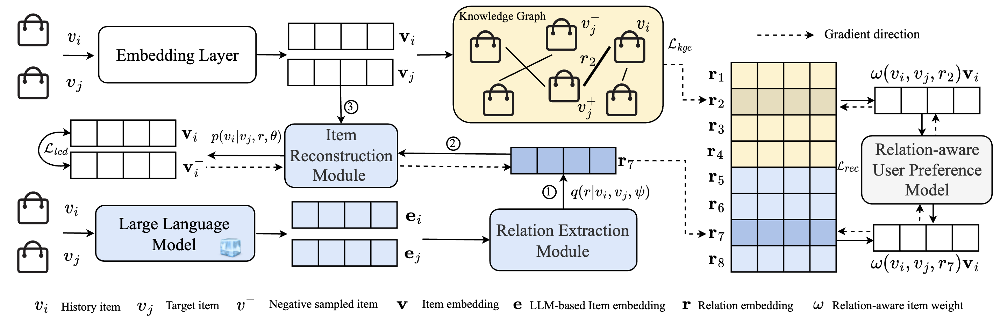
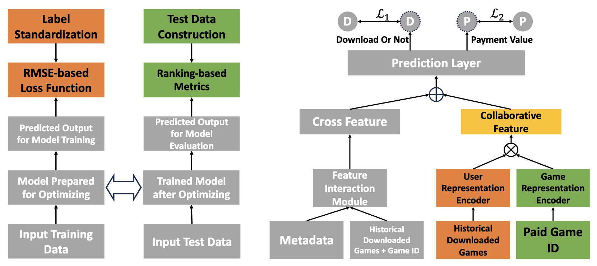
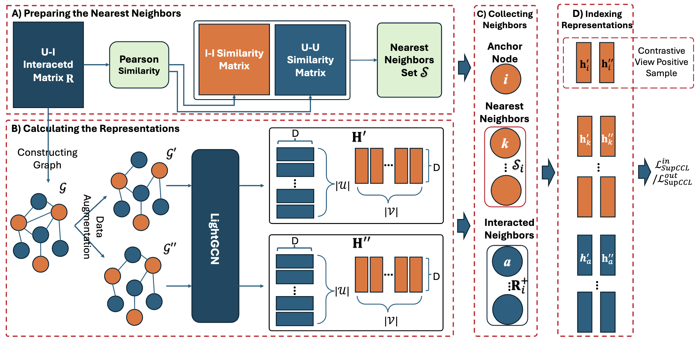
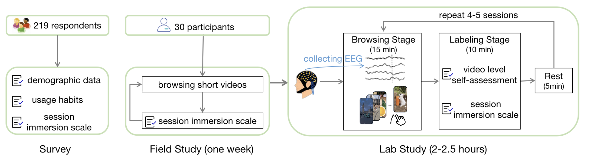
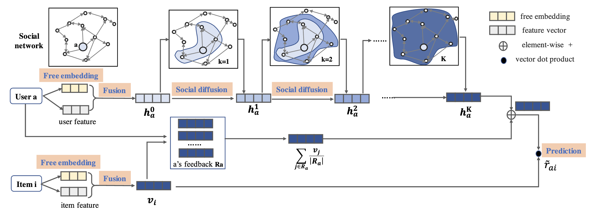

# 📝 Publications 
## 🎙 Speech Synthesis

SIGIR 2024

[Sequential Recommendation with Latent Relations based on Large Language Model](https://arxiv.org/abs/2403.18348) \\
Shenghao Yang, Weizhi Ma, **Peijie Sun**, Qingyao Ai, et al.

- **Academic Impact**: In this work, we leverage rich world knowledge which is compressed in LLM to discover latent item relations for enhanced recommendation. 

WWW 2024 Industry

[Collaborative-Enhanced Prediction of Spending on Newly Downloaded Mobile Games under Consumption Uncertainty](https://arxiv.org/abs/2404.08301) \\
**Peijie Sun**, Yifan Wang, Min Zhang, Chuhan Wu, et al.

- **Indudtry Impact**: The research outcomes of this work achieved a 50.65% increase in online revenue on Huawei HiMedia, and an 18.43% uplift in traffic across Huawei-related business scenarios.

IEEE TKDE 2023

[Neighborhood-Enhanced Supervised Contrastive Learning for Collaborative Filtering](https://ieeexplore.ieee.org/abstract/document/10255367) \\
**Peijie Sun**, Le Wu, Kun Zhang, Xiangzhi Chen, Meng Wang. 

- **Academic Impact**: Our proposed algorithm outperforms the best algorithm on the candidate matching leaderboard on BARS, significantly on [Yelp](https://openbenchmark.github.io/BARS/Matching/leaderboard/yelp18_m1.html) and [Gowalla](https://openbenchmark.github.io/BARS/Matching/leaderboard/gowalla_m1.html) datasets. Our proposed nearest neighbor-enhanced supervised contrastive module significantly outperforms the baseline model. On three real-world datasets, Yelp2018, Gowalla, and Amazon-Book, our model surpasses the original SGL by 10.09%, 7.09%, and 35.36% on NDCG@20, respectively.

CIKM 2023

[Understanding User Immersion in Online Short Video Interaction](https://dl.acm.org/doi/abs/10.1145/3583780.3615099) \\
Zhiyu He, Shaorun Zhang, **Peijie Sun**, Jiayu Li, Xiaohui Xie, Min Zhang, Yiqun Liu

- **Academic Impact**: In this study, we primarily investigate users' immersion states while browsing short videos. We argue that, instead of traditional metrics like user dwell time on short videos, immersion state should be considered as a more effective evaluation criterion for user satisfaction with short video content.

SIGIR 2019

[A Neural Influence Diffusion Model for Social Recommendation](https://dl.acm.org/doi/abs/10.1145/3331184.3331214) \\
Le Wu, **Peijie Sun**, Yanjie Fu, Richang Hong, Xiting Wang, Meng Wang

- **Academic Impact**: We are among the first to apply graph convolutional techniques to social recommendation tasks. According to Google Scholar, as of today, our work has garnered over 500 citations. Besides, we have also provied the [tensorflow and paddlepaddle](https://github.com/PeiJieSun/diffnet) version code. 
  

- ``SIGIR 2024 Resource`` [EEG-SVRec: An EEG Dataset with User Multidimensional Affective Engagement Labels in Short Video Recommendation](https://arxiv.org/abs/2404.01008), Shaorun Zhang, Zhiyu He, Ziyi Ye, **Peijie Sun**, et al. 
  
- ``SIGIR 2024 Long`` [Aiming at the Target: Filter Collaborative Information for Cross-Domain Recommendation](https://arxiv.org/abs/2403.20296), Hanyu Li, Weizhi Ma, **Peijie Sun**, Jiayu Li, et al. 

- ``DASFAA 2024 Long`` [A Situation-aware Enhancer for Personalized Recommendation](https://arxiv.org/abs/2403.18317), Jiayu Li, **Peijie Sun**, Chumeng Jiang, Weizhi Ma, Qingyao Ai, Min Zhang. 

- ``DASFAA 2024 Short`` [Common Sense Enhanced Knowledge-based Recommendation with Large Language Model](https://arxiv.org/abs/2403.18325), Shenghao Yang, Weizhi Ma, **Peijie Sun**, Min Zhang, et al.

- ``WWW 2023 Long`` [Intersectional Two-sided Fairness in Recommendation](https://arxiv.org/abs/2402.02816), Yifan Wang, **Peijie Sun**, Weizhi Ma, Min Zhang, et al.

- ``KDD 2023 Long`` [Unbiased Delayed Feedback Label Correction for Conversion Rate Prediction](https://dl.acm.org/doi/abs/10.1145/3580305.3599536), Yifan Wang, Peijie Sun, Min Zhang, Qinglin Jia, et al.

- ``SIGIR 2023 Long`` [Topic-enhanced Graph Neural Networks for Extraction-based Explainable Recommendation](https://dl.acm.org/doi/abs/10.1145/3539618.3591776), Jie Shuai, Le Wu, Kun Zhang, **Peijie Sun**, et al.

- ``SIGIR 2023 Long`` [Intent-aware Ranking Ensemble for Personalized Recommendation](https://dl.acm.org/doi/abs/10.1145/3539618.3591702), Jiayu Li, **Peijie Sun**, Zhefan Wang, Weizhi Ma, et al.

- ``IEEE TMM 2023`` [Multimodal graph contrastive learning for multimedia-based recommendation](https://ieeexplore.ieee.org/abstract/document/10075502/), Kang Liu, Feng Xue, Dan Guo, **Peijie Sun**, et al.

- ``SIGIR 2022 Long`` [ProFairRec: Provider fairness-aware news recommendation](https://dl.acm.org/doi/abs/10.1145/3477495.3532046), Tao Qi, Fangzhao Wu, Chuhan Wu, **Peijie Sun**, et al.

- ``SIGIR 2022 Long`` [A review-aware graph contrastive learning framework for recommendation](https://dl.acm.org/doi/abs/10.1145/3477495.3531927), Jie Shuai, Kun Zhang, Le Wu, **Peijie Sun**, et al.

- ``ACM TOIS 2021`` [An unsupervised aspect-aware recommendation model with explanation text generation](https://dl.acm.org/doi/abs/10.1145/3483611), Peijie Sun, Le Wu, Kun Zhang, Yu Su, et al.

- ``IEEE TKDE 2020`` [Diffnet++: A neural influence and interest diffusion network for social recommendation](https://ieeexplore.ieee.org/abstract/document/9311623/), Le Wu, Junwei Li, **Peijie Sun**, Richang Hong, et al.

- ``WWW 2020 Long`` [Dual learning for explainable recommendation: Towards unifying user preference prediction and review generation](https://dl.acm.org/doi/abs/10.1145/3366423.3380164), **Peijie Sun**, Le Wu, Kun Zhang, Yanjie Fu, et al.

- ``SIGIR 2019 Long`` [A neural influence diffusion model for social recommendation](https://dl.acm.org/doi/abs/10.1145/3331184.3331214), Le Wu, **Peijie Sun**, Yanjie Fu, Richang Hong, et al.

- ``IEEE Trans. SMC 2018`` [Collaborative neural social recommendation](https://ieeexplore.ieee.org/abstract/document/8514809/), Le Wu, **Peijie Sun**, Richang Hong, Yong Ge, et al.

- ``SIGIR 2018 Long`` [Attentive recurrent social recommendation](https://dl.acm.org/doi/abs/10.1145/3209978.3210023), **Peijie Sun,** Le Wu, Meng Wang. 
